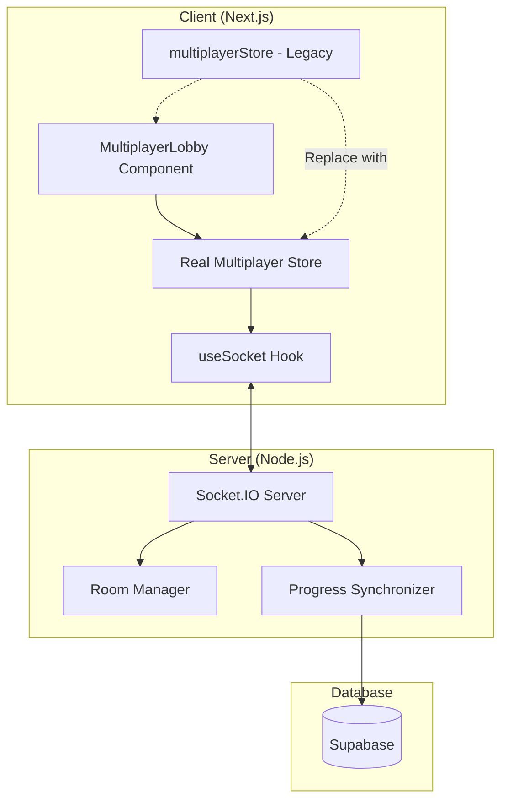

# Design Document

## Overview

This design document outlines the integration of real Socket.IO multiplayer functionality into the typing speed test application. The system will replace the current simulation-based multiplayer with true real-time multiplayer where players connect to a Socket.IO server, join rooms, and compete in synchronized typing races with automatic result persistence to Supabase.

The architecture follows a client-server model where the Next.js frontend communicates with a Node.js Socket.IO server for real-time synchronization, while maintaining integration with the existing Zustand stores, UI components, and Supabase persistence layer.

## Architecture



The architecture employs a layered approach:

1. **Presentation Layer**: MultiplayerLobby component provides the user interface
2. **State Management Layer**: Real Multiplayer Store manages client-side state and Socket.IO integration
3. **Communication Layer**: useSocket hook abstracts Socket.IO client operations
4. **Server Layer**: Node.js Socket.IO server handles real-time communication and room management
5. **Persistence Layer**: Supabase database stores race results and player statistics

## Components and Interfaces

### Client-Side Components

#### Real Multiplayer Store Interface

```typescript
interface RealMultiplayerState {
  // Connection state
  room: Room | null;
  currentPlayer: Player | null;
  playerId: string | null;
  isConnected: boolean;
  error: string | null;
  
  // Typing state
  typedChars: number;
  cursorIndex: number;
  startedAt: number | null;
  
  // Connection actions
  setRoom: (room: Room | null) => void;
  setCurrentPlayer: (player: Player | null) => void;
  setPlayerId: (id: string) => void;
  setConnected: (connected: boolean) => void;
  setError: (error: string | null) => void;
  
  // Typing actions
  typeChar: (char: string, expected: string) => Promise<void>;
  backspace: () => Promise<void>;
  resetTyping: () => void;
  
  // Race actions
  startRace: (targetText: string, startTime: number) => void;
}
```

#### Socket Hook Interface

```typescript
interface UseSocketReturn {
  socket: Socket | null;
  isConnected: boolean;
  createRoom: (username: string) => void;
  joinRoom: (roomId: string, username: string) => void;
  leaveRoom: () => void;
  playerReady: () => void;
  sendTypingProgress: (progress: ProgressData) => void;
}

interface ProgressData {
  progress: number;
  wpm: number;
  accuracy: number;
  typedChars: number;
  correctChars: number;
}
```

### Server-Side Components

#### Room Manager

```typescript
interface RoomManager {
  createRoom(): Room;
  getRoom(roomId: string): Room | undefined;
  addPlayerToRoom(roomId: string, playerId: string, playerData: PlayerData): boolean;
  removePlayerFromRoom(roomId: string, playerId: string): boolean;
  startCountdown(room: Room): void;
  broadcastRoomState(room: Room): void;
  cleanupEmptyRooms(): void;
}

interface Room {
  id: string;
  status: 'waiting' | 'countdown' | 'racing' | 'finished';
  players: Map<string, Player>;
  maxPlayers: number;
  targetText: string;
  createdAt: number;
  countdownTimer: NodeJS.Timeout | null;
  raceStartTime: number | null;
}
```

#### Progress Synchronizer

```typescript
interface ProgressSynchronizer {
  validateProgress(playerId: string, progress: ProgressData): boolean;
  updatePlayerProgress(room: Room, playerId: string, progress: ProgressData): void;
  calculateFinishRank(room: Room, playerId: string): number;
  checkRaceCompletion(room: Room): boolean;
  saveResults(room: Room): Promise<void>;
}
```

## Data Models

### Client-Server Communication Events

#### Client-to-Server Events

```typescript
interface ClientEvents {
  create_room: { username: string; playerId: string };
  join_room: { roomId: string; username: string; playerId: string };
  leave_room: {};
  player_ready: {};
  typing_progress: {
    progress: number;
    wpm: number;
    accuracy: number;
    typedChars: number;
    correctChars: number;
  };
}
```

#### Server-to-Client Events

```typescript
interface ServerEvents {
  room_created: { roomId: string; playerId: string };
  room_joined: { roomId: string; playerId: string };
  room_update: {
    id: string;
    status: RoomStatus;
    players: Player[];
    targetText: string;
    maxPlayers: number;
  };
  countdown_start: { count: number };
  countdown_tick: { count: number };
  race_start: { targetText: string; startTime: number };
  error: { message: string };
}
```

### Database Schema Extensions

The existing Supabase schema will be extended to support multiplayer race results:

```sql
ALTER TABLE typing_results 
ADD COLUMN multiplayer_room_id VARCHAR(10),
ADD COLUMN finish_rank INTEGER,
ADD COLUMN player_count INTEGER;

CREATE INDEX idx_typing_results_multiplayer 
ON typing_results(mode, multiplayer_room_id);
```

## Correctness Properties

*A property is a characteristic or behavior that should hold true across all valid executions of a system-essentially, a formal statement about what the system should do. Properties serve as the bridge between human-readable specifications and machine-verifiable correctness guarantees.*

### Property 1: Connection State Consistency

*For any* Socket.IO connection or disconnection event, the Real Multiplayer Store connection status SHALL accurately reflect the actual socket connection state and be synchronized across all store consumers.

**Validates: Requirements 1.2, 1.3**

### Property 2: Room Creation and Management

*For any* room creation request, the Socket.IO server SHALL generate a unique room code, add the requesting player to the room, and return correct room and player identifiers to the client.

**Validates: Requirements 2.1, 2.2**

### Property 3: Room Joining and Capacity Management  

*For any* room join request with valid room code and available space, the Socket.IO server SHALL add the player to the room and broadcast updated room state; for any room at maximum capacity, join requests SHALL be rejected with appropriate error messages.

**Validates: Requirements 2.3, 2.4**

### Property 4: Player Management and Cleanup

*For any* player leaving a room, the Socket.IO server SHALL remove the player and notify remaining players; for any room where all players leave, the server SHALL automatically delete the room.

**Validates: Requirements 2.5, 2.6**

### Property 5: Progress Broadcast Synchronization

*For any* typing progress update sent by a player during an active race, all other players in the same room SHALL receive the progress update containing all required metrics (WPM, accuracy, completion percentage, character counts).

**Validates: Requirements 3.1, 3.5, 5.2, 5.3**

### Property 6: Race State Management

*For any* player finishing the race or all players finishing, the Socket.IO server SHALL calculate correct finish ranks based on completion order and transition room status to finished when appropriate.

**Validates: Requirements 3.3, 3.4**

### Property 7: UI State Synchronization

*For any* room state change received via Socket.IO, the Real Multiplayer Store SHALL update and trigger UI re-renders to display current player positions and progress data.

**Validates: Requirements 3.2, 8.2, 8.4**

### Property 8: Race Start Synchronization

*For any* countdown completion when all players are ready, the Socket.IO server SHALL broadcast race start events to all room participants with identical target text and synchronized start timestamps within network latency bounds.

**Validates: Requirements 4.1, 4.2, 4.3, 4.5**

### Property 9: Typing Input Processing

*For any* typing input (character entry or backspace) during an active race, the Real Multiplayer Store SHALL calculate updated progress metrics and send progress updates to the server with correct WPM, accuracy, and character count data.

**Validates: Requirements 5.1, 5.4, 5.5**

### Property 10: Result Persistence Completeness

*For any* completed multiplayer race, the Socket.IO server SHALL automatically save results for all participants to Supabase with complete race data including duration, final metrics, character counts, and finish rankings.

**Validates: Requirements 6.1, 6.2, 6.5**

### Property 11: Connection Recovery and Room Rejoining

*For any* connection restoration after interruption, the client SHALL attempt to rejoin the previous room if it still exists; for any failed rejoin attempt, the store SHALL reset to disconnected state and allow new room creation.

**Validates: Requirements 1.4, 7.3, 7.4**

### Property 12: Component Integration Consistency

*For any* user interaction with lobby controls, the Real Multiplayer Store SHALL send appropriate Socket.IO events to the server while maintaining consistent UI behavior with the simulation version.

**Validates: Requirements 8.1, 8.3, 8.5**

## Error Handling

### Connection Error Handling

1. **Initial Connection Failures**: Display user-friendly error messages and provide retry mechanisms
2. **Mid-Race Disconnections**: Show connection warnings while attempting automatic reconnection
3. **Server Unavailability**: Gracefully degrade to offline mode or simulation if configured
4. **Authentication Failures**: Clear error messages with guidance for resolution

### Room Management Error Handling

1. **Room Not Found**: Clear error messages when attempting to join non-existent rooms
2. **Room Full**: Informative messages when attempting to join at-capacity rooms
3. **Race In Progress**: Prevent joining rooms where races have already started
4. **Invalid Room Codes**: Validation and user feedback for malformed room codes

### Progress Synchronization Error Handling

1. **Invalid Progress Data**: Server-side validation with error logging and client notification
2. **Race State Mismatches**: Reconciliation mechanisms for out-of-sync race states
3. **Timestamp Validation**: Handling of client-server time differences
4. **Progress Calculation Errors**: Fallback mechanisms for corrupted progress data

### Database Error Handling

1. **Supabase Connectivity**: Retry mechanisms with exponential backoff
2. **Result Save Failures**: Error logging while allowing race continuation
3. **Schema Validation**: Proper error handling for malformed result data
4. **Connection Pool Exhaustion**: Queue management and timeout handling

## Testing Strategy

### Unit Testing

Unit tests will focus on specific components and their isolated functionality:

1. **Real Multiplayer Store**: Test state transitions, typing calculations, and action dispatching
2. **Socket Hook**: Test event handling, connection management, and error scenarios
3. **Progress Calculations**: Test WPM, accuracy, and progress percentage calculations
4. **Room Management**: Test room creation, player management, and state transitions
5. **Error Handling**: Test error scenarios and recovery mechanisms

### Property-Based Testing

Property-based tests will validate the correctness properties defined above:

1. **Connection State Property**: Generate random connection events and verify store consistency
2. **Room Synchronization Property**: Test room state updates with multiple simulated clients
3. **Progress Broadcast Property**: Verify progress data integrity across client-server communication
4. **Race Synchronization Property**: Test countdown and race start timing across multiple clients
5. **Result Persistence Property**: Verify complete and accurate result storage
6. **Connection Recovery Property**: Test reconnection scenarios and state restoration
7. **Input Integration Property**: Test typing input round-trip accuracy

Each property test will run a minimum of 100 iterations to ensure comprehensive coverage across the input space. Tests will be tagged with: **Feature: socket-io-multiplayer-integration, Property {number}: {property_text}**

### Integration Testing

Integration tests will verify end-to-end functionality:

1. **Full Multiplayer Flow**: Create room, join players, race, and save results
2. **Cross-Client Communication**: Multiple browser instances simulating real usage
3. **Server Load Testing**: Multiple concurrent rooms and players
4. **Database Integration**: End-to-end result persistence verification
5. **Error Recovery Testing**: Network interruption and reconnection scenarios

### Performance Testing

Performance tests will ensure the system meets scalability requirements:

1. **Concurrent Room Limits**: Test maximum number of simultaneous rooms
2. **Player Count Scaling**: Test performance with maximum players per room
3. **Message Throughput**: Test real-time progress update handling capacity
4. **Database Performance**: Test result persistence under load
5. **Memory Usage**: Monitor server memory consumption during extended operation